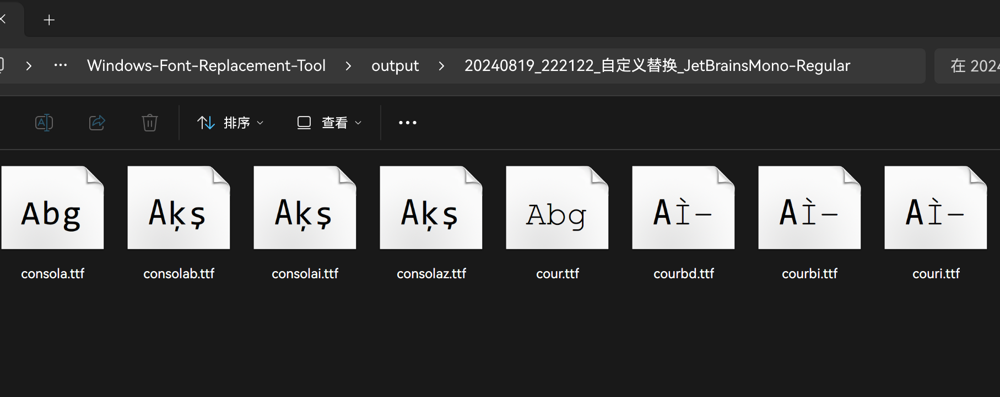

欢迎使用我的工具，本工具使用 Python 编写。以下是本工具的简要说明，希望能够帮助到您。

#### 1. 单字重字体 DIY

非常简单，只需要先点击 <mark style="background: #FFF3A3A6;">“我的字体只有一个字重”</mark> 按钮，然后选择你想要替换的字体，程序便会立刻开始工作，你只需「坐和放宽」，稍等几秒就可以得到可以用于替换系统默认 UI 的字体。

#### 2. 多字重字体 DIY

这一部分稍显麻烦，但也会使你 DIY 出来的字体实装后拥有更好的外观。先点击 <mark style="background: #FFF3A3A6;">“我的字体有多个字重”</mark> 按钮，此时多字重字体编辑区内的标签会变成<mark style="background: #D2B3FFA6;">紫色</mark>，点击任意一个字形标签右边的 <mark style="background: #FFF3A3A6;">“选择字体”</mark> 按钮，即可为该字形选择单独的替换文件。


选择好字体以后，对应字形的标签会变成<mark style="background: #BBFABBA6;">绿色的</mark>，并且当你的鼠标指针置于这个标签上方时，会显示当前选中的字体是什么。

> [!TIP] **我该如何选择不同字形对应的字体文件？**
>
> 一般来说，拥有多个自重的字体文件的文件名会有专门的标识名称来区分不同字重的文件，常见字重的名称按照从细到粗排序，大致是这样的：
>
> $$\rm Thin\approx Extra(Ultra)Light\lt Light\lt Semi(Demi)Light\lt Regular\approx Normal\lt Medium$$
> 
> $$\rm Medium\lt Semi(Demi)Bold\lt Bold\lt Black\approx Heavy\lt Extra(Ultra)Black$$
> 
> 不同厂商所制作的字体，其字重标识名称存在差异，因此不必太过追求完美，大致按照上述排序，选择差不多的字体文件即可；当然，你也可以用同一个字体来替换多种不同的字形，例如你可以将“细体”、“半细”、“常规”三种字型全部设置为 $\rm Regular$，或者将同一种字重的常规字体和斜体字体设置为一样的，这么做通常来说不会有什么大的问题，<mark style="background: #ABF7F7A6;">甚至有可能让屏幕上的部分细体或粗体字变得更加容易阅读</mark>。

你必须选择完全部 16 种字形后，<mark style="background: #FFF3A3A6;">“开始制作”</mark> 按钮才会亮起。

#### 3. 自定义字体 DIY

该部分可能有一些内容较为拗口和难以理解，如果你有更好的表述方法，欢迎提出建议。

如果你只想替换系统默认界面的字体（微软雅黑），那么你可以完全跳过这部分，如果你只想替换 `宋体`，那么请跳过第 2-3 步。

Windows 系统内还自带了大量的字体，一些软件和网页常常会使用这些自带的字体作为他们的默认字体使用，例如 `Times New Roman`、`Consolas` 和 `宋体`，如果你不喜欢这些字体，那么你可以采用自定义替换功能，来把这些字体换成你喜欢的字体，现在假设我不喜欢 `Consolas` 字体和 `Courier New` 字体，并希望将其伪装成 `JetBrains Mono` 字体，那么我应该这样做：

1. 打开 `C:\Windows\Fonts` 目录，搜索 `Consolas` 和 `Courier New` 字体，将他们全部复制到另一个新的目录下，例如 `D:\123`。<mark style="background: #FFB86CA6;">（这很重要）</mark>


2. 运行工具，在“自定义字体替换”一栏中，点选 <mark style="background: #FFF3A3A6;">“批量替换”</mark>，先点击 <mark style="background: #FFF3A3A6;">“个性字体”</mark> 按钮，打开 `JetBrains Mono` 字体，然后点击 <mark style="background: #FFF3A3A6;">“待替换字体”</mark> 按钮，进入 `D:\123` 目录，~~按下 `Ctrl+A` 选择全部的字体~~，再点击 <mark style="background: #FFF3A3A6;">“开始制作”</mark>，待弹出完成提示后，你就可以点击右下角 <mark style="background: #FFF3A3A6;">“打开输出目录”</mark>，查看这八个做好了的字体，点开预览这些字体，你可以看到它们的名称仍然是 `Consolas` 或 `Courier New`，但是其外观已经变成了 `JetBrains Mono` 字体所对应的外观。


3. 细心的你可能会发现上面这张图中，除了第一个文件和第五个文件，其他文件均有乱码，这是因为在第二步的过程中，我使用 `JetBrains Mono`的 `Regular` 字形，替换了 `Consolas` 和 `Courier New` 的 `Regular`、`Italic`、`Bold`、`Bold Italic`，四种字形，这样做使得 `Consolas` 和 `Courier New` 字体<mark style="background: #FFB86CA6;">丢失了斜体、粗体和粗斜体的字形</mark>，于是产生了乱码。但是正常情况下这么做不会有什么问题，唯一的问题是，如果你遇到了一些<mark style="background: #FFB86CA6;">需要通过斜体和粗体来区分内容的文本时，你看到的所有字都是一样的</mark>，这也是为什么我使用~~删除线~~在第 2 步中标注出了不太完美的操作方法，最为完美的操作方式应该是依次选择 `Consolas` 和 `Courier New` 的四种字形，用 `JetBrains Mono`与之对应的字形一一替换他们，共替换四次（这也会使八个字体被分散到四个不同的文件夹里）。
4. 此外，该工具还可以用来替换宋体等 `.ttc` 字体，要想替换这类字体，你必须点选 <mark style="background: #FFF3A3A6;">“单个替换”</mark> 选项，按照与第二步相同的方式点击 <mark style="background: #FFF3A3A6;">“个性字体”</mark> 按钮，打开你想制作字体，然后点击 <mark style="background: #FFF3A3A6;">“待替换字体”</mark> 按钮，选择宋体（复制到外部文件夹后，宋体的文件名是`simsun.ttc`），再点击“开始制作”，即可得到伪装后的宋体字体。

- [!] **由于许多较为古老的软件有对宋体做专门的优化，这使得替换宋体后，一些软件可能会出现各种各样奇奇怪怪的问题，除此之外，如果你是学生且有书写论文的需求，替换宋体可能会使大部分的论文因缺少宋体而不符合格式要求。因此请在替换宋体前三思而后行！！！**

#### 4. 将替换好的字体实装

正常情况下，使用命令行实装字体是最稳定的方式，并且几乎不可能导致系统问题，如果你对自己的操作没有信心，那么请创建一个系统还原点来确保万无一失，具体操作方法，建议 [参考这个](https://support.microsoft.com/zh-cn/windows/%E5%88%9B%E5%BB%BA%E7%B3%BB%E7%BB%9F%E8%BF%98%E5%8E%9F%E7%82%B9-77e02e2a-3298-c869-9974-ef5658ea3be9)。

如果你 DIY 的字体是雅黑系列的字体或者宋体，那么你必须使用命令行替换的方法来将替换好了的字体实装，以下是操作方法：

1. 将制作好的字体从导出目录下移动到一个好记的位置，例如 `C:\123` 或 `C:\aaa`，请注意，<mark style="background: #FFB86CA6;">**这个目录的完整路径下不能存在任何中文字符！！**路径内应该仅包含等待实装的 16 个字体文件，不能有其他的子文件夹；</mark>
2. 这里以 Win11 系统为例，打开设置 - 系统 - 恢复 - 高级启动，先保存好你所有未完成的文档，然后点击旁边的 “立即重新启动” 按钮，等待一段时间后，即可进入蓝色的高级启动界面。如果你的 Windows 版本与我不一致，建议 [问度娘](https://www.baidu.com/baidu?ie=utf-8&wd=windows%E5%A6%82%E4%BD%95%E8%BF%9B%E5%85%A5%E9%AB%98%E7%BA%A7%E5%90%AF%E5%8A%A8) 或者 [问 Bing](https://cn.bing.com/search?q=windows%E5%A6%82%E4%BD%95%E8%BF%9B%E5%85%A5%E9%AB%98%E7%BA%A7%E5%90%AF%E5%8A%A8)；
3. 进入高级启动界面后，使用键盘方向键，将选择框移动到 “疑难解答” 上方，按下 `enter` 进入，然后依次选中并进入 “高级选项” - “命令提示符”，你将看到一个黑色的，Win7 风格的对话框；
4. 假设你刚才把制作好的字体放在了 `C:\123` 目录下，那么请在这个对话框中输入以下字符：
```
xcopy C:\123 C:\windows\fonts
```
5. 如果一切正常的话，对话框会提示你是否全部覆盖，在键盘上按下“是”所对应的选项，片刻之后就会提示你替换已完成，这个时候按下 `alt+F4`，即可退出命令提示符。此时选择继续使用 Windows，系统重新启动后，字体便替换好了

如果你替换的是其他系统自带的字体，正常情况下直接右键字体，选择“为所有用户安装” 并替换现有的字体即可完成替换，有的时候可能需要重新启动来使字体生效。

<div align="center">
	
</div>
